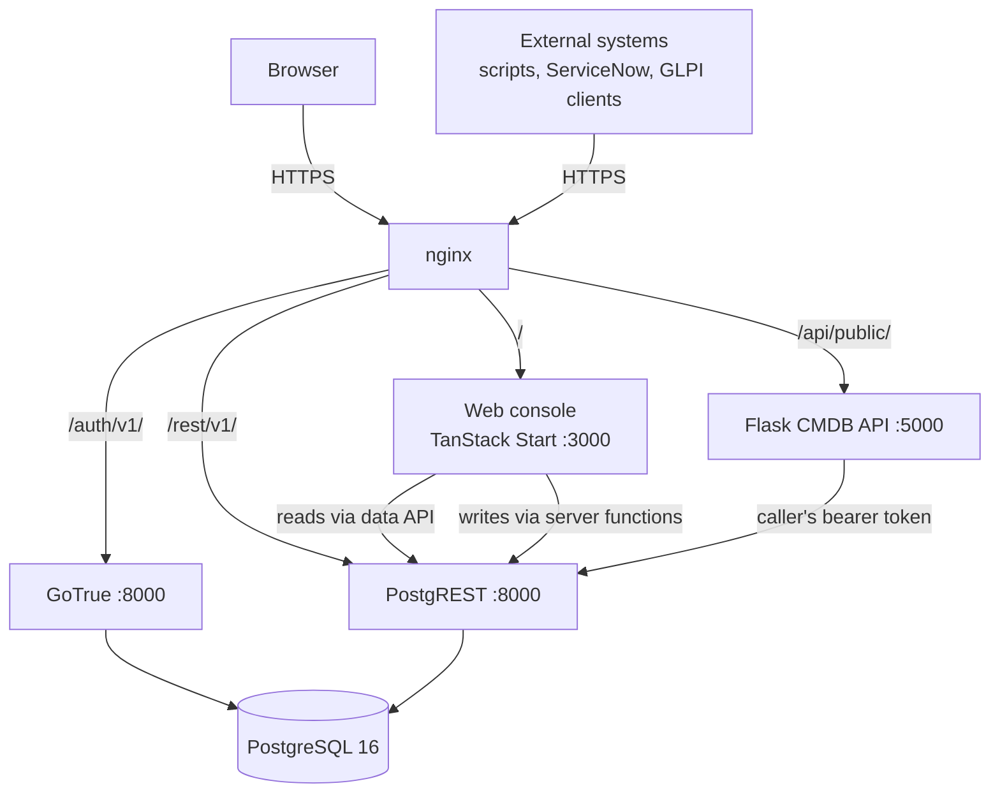
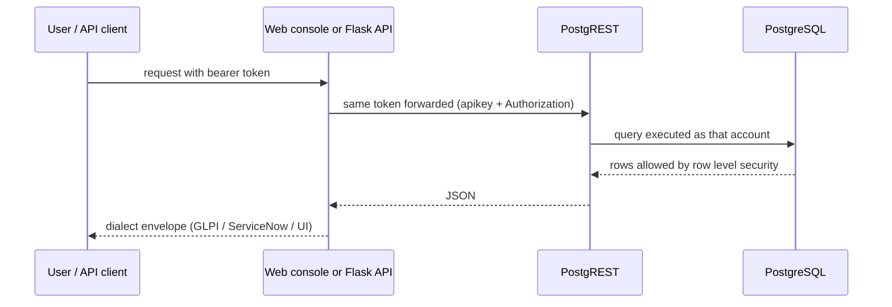
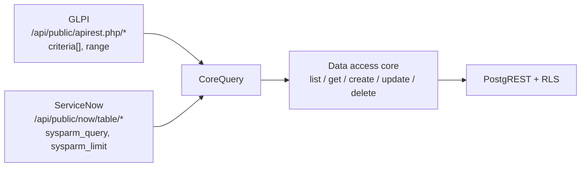

# Architecture

## Components

| Piece | Technology | Where it runs |
| --- | --- | --- |
| Web console | TanStack Start v1, React 19, Vite 7, Tailwind v4 | systemd `cb-assets`, port 3000 |
| CMDB REST API | Python 3 / Flask + gunicorn (`backend/`) | systemd `cb-assets-api`, port 5000 |
| Bundled REST API (fallback) | TypeScript route `src/routes/api/public/$.ts` | inside the web app |
| Database | PostgreSQL 16 | Docker, `127.0.0.1:5432` |
| Accounts / sign-in | GoTrue | Docker, behind `/auth/v1/` |
| Data API | PostgREST | Docker, behind `/rest/v1/` |
| Front door | nginx, port 80/443 | the VM |

## System diagram



## Request flow

Reads and writes both end at PostgreSQL, and row level security is the single
place access is decided — there is no second permission layer to keep in sync.



Anonymous callers get `401`; a viewer can read; editors can create and update;
admins can additionally delete and manage accounts.

## The two API dialects

Both dialects parse their own query shape into one internal `CoreQuery`
(`filters`, `fields`, `sort`, `ascending`, `offset`, `limit`) and call one
shared data-access core. Only the envelope differs.



Implementations, kept mirrored:

| Concern | TypeScript | Python |
| --- | --- | --- |
| CI class registry | `src/lib/cmdb-api/classes.ts` | `backend/cmdb/classes.py` |
| Shared core | `src/lib/cmdb-api/core.ts` | `backend/cmdb/core.py` |
| GLPI dialect | `src/lib/glpi-api.ts` | `backend/cmdb/glpi.py` |
| ServiceNow dialect | `src/lib/servicenow-api.ts` | `backend/cmdb/snow.py` |
| Dialect on/off | `API_DIALECTS` in `cmdb-api/config.ts` | `API_DIALECTS` in `classes.py` |

## Front-end structure

```
src/routes/               file-based routes
  index.tsx               dashboard with KPI tiles
  servers|databases|switches|access-points/
    index.tsx             list + support pie chart + export
    $sysId.tsx            record detail, tabs, edit
  new.tsx                 create a record (editor/admin)
  admin/users.tsx         accounts and roles (admin)
  auth.tsx                sign in
  api.tsx                 API reference page
  api/public/$.ts         bundled REST API catch-all
src/components/cmdb/      site chrome, list, detail, support chart
src/lib/                  schema, data queries, server functions, exports
```

Server functions (`*.functions.ts`) carry every write: `createCiRecord`,
`updateCiRecord`, `deleteCiRecords`, `setCiSnoozed`, and the account functions
`listAppUsers`, `createUserAccount`, `grantUserRole`, `revokeUserRole`,
`renameUser`, `deleteUserAccount`.
