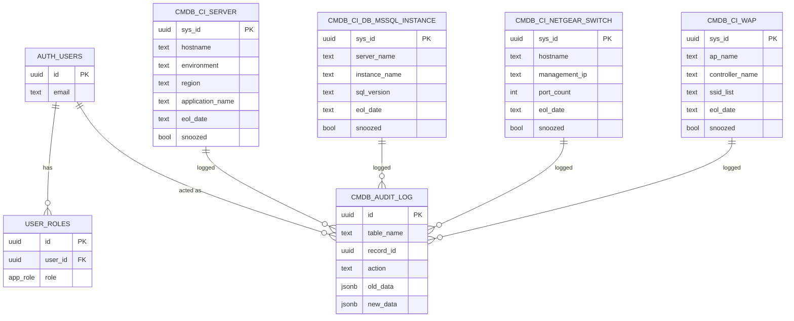

# Data model

Every configuration item table shares four system columns: `sys_id` (uuid,
primary key), `sys_class_name`, `sys_created_on`, `sys_updated_on`, plus a
`snoozed` boolean flag. `sys_updated_on` is maintained by a trigger, and every
insert, update and delete is written to `cmdb_audit_log` by a second trigger.

## Tables

## CI classes

| Table | Display field | UI path | GLPI itemtype | ServiceNow table | Fields |
| --- | --- | --- | --- | --- | --- |
| `cmdb_ci_server` | `hostname` | `/servers` | `Computer` | `cmdb_ci_server` | 47 |
| `cmdb_ci_db_mssql_instance` | `server_name` | `/databases` | `DatabaseInstance` | `cmdb_ci_db_mssql_instance` | 50 |
| `cmdb_ci_netgear_switch` | `hostname` | `/switches` | `NetworkEquipment` | `cmdb_ci_netgear_switch` | 42 |
| `cmdb_ci_wap` | `ap_name` | `/access-points` | `AccessPoint` | `cmdb_ci_wap` | 41 |

Every class's Lifecycle group includes three ESU (Extended Security Updates)
fields: `esu` (one of `EOL`, `Active`, `N/A`, `False`), `esu_start_date` and
`esu_end_date`.

The authoritative field list lives in `src/lib/cmdb-schema.ts`. Each field has a
name, a label and a group; groups drive the tabs on a record page:

- **Servers** — Identity, Location, Service, Ownership, Hardware, Platform, Lifecycle, Operations
- **SQL instances** — Identity, Location, Service, Ownership, Platform, Capacity, Lifecycle, Operations, Accounts
- **Switches** — Identity, Location, Service, Ownership, Hardware, Network, Lifecycle, Operations
- **Access points** — Identity, Location, Service, Ownership, Hardware, Wireless, Network, Lifecycle, Operations

Integer columns (forms submit numbers, not text): `sql_port`, `cpu_count`,
`core_count`, `memory_gb`, `port_count`, `stack_member_count`, `vlan_count`,
`client_capacity`.

## Support status

Derived in `src/lib/support-status.ts`, never stored:

| Status | Rule | Colour |
| --- | --- | --- |
| Out of support | `eol_date` is in the past | red |
| Expiring within 6 months | `eol_date` within the next 6 months | amber |
| In support | `eol_date` further out | green |
| No EOL date | no parsable date; falls back to `support_cycle` keywords | grey |

`eol_date` accepts ISO dates and `dd-mm-yyyy` / `dd/mm/yyyy`.

The `snoozed` flag is independent: snoozing an item never changes its support
status or how it counts in the pie chart. It only marks that someone is aware
of it.

## Governance tables

| Table | Purpose | Who can read |
| --- | --- | --- |
| `cmdb_audit_log` | Append-only record of every CI change (who, when, before, after) | admins |
| `personal_data_register` | GDPR record of processing activities | signed-in users; admins maintain |
| `data_subject_requests` | Access / erasure requests and their handling | admins |
| `user_roles` | Role grants (`admin`, `editor`, `viewer`) | own rows; admins manage all |
