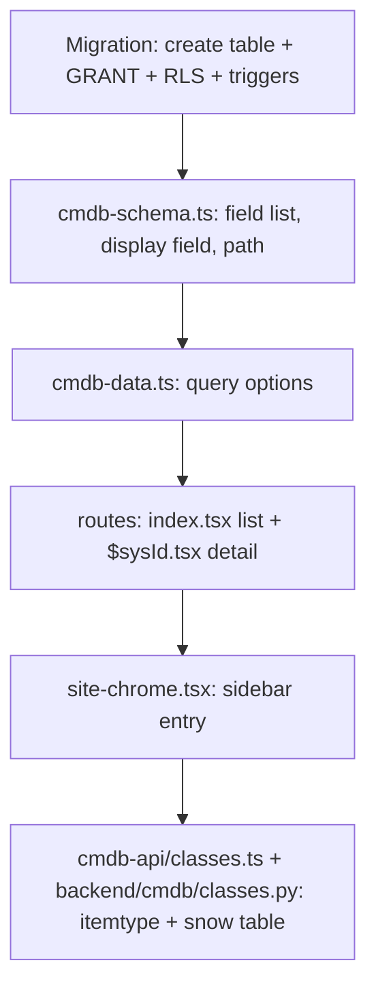

# Development

## Running locally

```sh
bun install
bun run dev          # website on :8080
```

Environment for the web app comes from `.env`
(`VITE_SUPABASE_URL`, `VITE_SUPABASE_PUBLISHABLE_KEY`).

The Flask API is separate:

```sh
cd backend
python3 -m venv .venv && source .venv/bin/activate
pip install -r requirements.txt
cp .env.example .env          # SUPABASE_URL + SUPABASE_PUBLISHABLE_KEY
set -a && . ./.env && set +a
flask --app cmdb run --port 5000
```

Checks: `bunx tsgo --noEmit` for types, `bun run lint` for lint.

## Layout

```
src/
  routes/              file-based routing (TanStack Router)
  components/cmdb/     site-chrome, ci-list, ci-detail, support-chart
  lib/
    cmdb-schema.ts     field definitions per CI class  <- single source of truth
    cmdb-data.ts       query options used by loaders and components
    cmdb-*.functions.ts  server functions (all writes)
    cmdb-api/          dialect-agnostic core, class registry, dialect flags
    glpi-api.ts        GLPI dialect
    servicenow-api.ts  ServiceNow dialect
    support-status.ts  EOL -> support status
    csv-export.ts      CSV / JSON download
  integrations/supabase/  generated client, auth middleware (do not edit)
backend/               Python/Flask mirror of the API
deploy/                Ubuntu installer, systemd units, nginx, selfhost stack
supabase/migrations/   ordered SQL migrations
docs/                  this documentation
```

## Conventions

- **Writes go through server functions.** Every mutating path uses
  `createServerFn` with `requireSupabaseAuth` and Zod-validated input; field
  names are whitelisted against `cmdb-schema.ts` before touching the database.
- **Permissions are database-side.** Never re-implement a rule in TypeScript
  that row level security already enforces.
- **One CoreQuery.** Each dialect parses its own query syntax into
  `{ filters, fields, sort, ascending, offset, limit }` and calls the shared
  core; only the response envelope is dialect-specific.
- **Design tokens only.** Colours and spacing come from `src/styles.css`; no
  hardcoded colour utilities in components.
- **Keep TypeScript and Python in sync.** `cmdb-api/classes.ts` and
  `backend/cmdb/classes.py` must list the same CI classes.

## Adding a CI class



Every new public table needs, in this order: `CREATE TABLE`, `GRANT` to the
roles its policies mention, `ENABLE ROW LEVEL SECURITY`, then the policies,
plus the `set_sys_updated_on` and `log_cmdb_change` triggers so it is audited
like the rest.

## Adding or renaming a field

Add it to the table in a migration and to the right group in
`src/lib/cmdb-schema.ts`. Lists, detail tabs, the create form, the edit form
and CSV/JSON exports all read from that definition, so nothing else changes. If
the column is an integer, add its name to `NUMERIC_FIELDS`.

## Switching dialects off

`API_DIALECTS` in `src/lib/cmdb-api/config.ts` and `backend/cmdb/classes.py`
toggles GLPI and ServiceNow independently — flip the flag and point clients at
the other base path.
