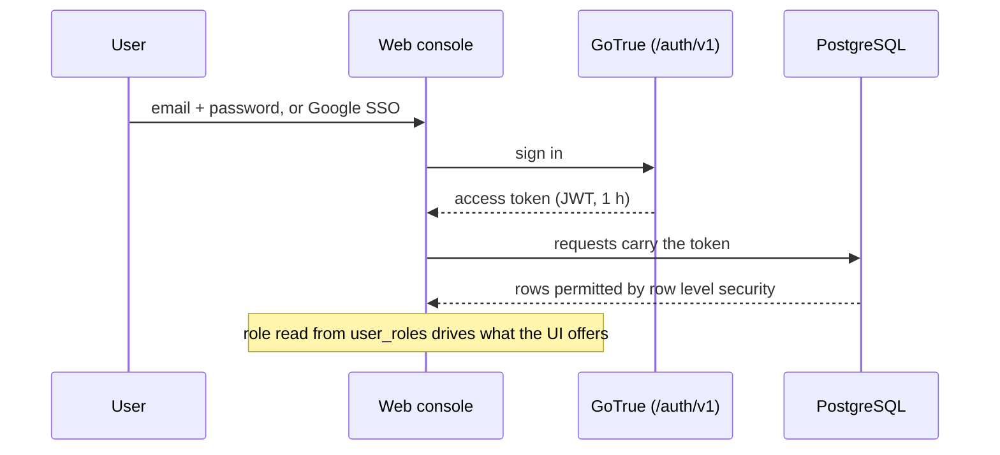

# Accounts and permissions

## Roles

Roles live in their own table (`public.user_roles`), never on a profile row, and
are typed by the `app_role` enum. A user may hold more than one role.

| Role | Read inventory | Create / edit | Delete | Manage accounts | Read audit log |
| --- | --- | --- | --- | --- | --- |
| `admin` | yes | yes | yes | yes | yes |
| `editor` | yes | yes | no | no | no |
| `viewer` | yes | no | no | no | no |
| anonymous | no (`401`) | no | no | no | no |

The first account created becomes an administrator; later accounts default to
`viewer` and are adjusted under **Users & permissions**.

## How it is enforced

Two SQL helpers back every policy:

- `public.has_role(_user_id uuid, _role app_role)` — boolean role check
- `public.can_write(_user_id uuid)` — true for `admin` or `editor`

Both are `SECURITY INVOKER` and take the caller's uid explicitly, and every CI
table has policies of this shape:

```sql
SELECT  TO authenticated USING (true)
INSERT  TO authenticated WITH CHECK (public.can_write(auth.uid()))
UPDATE  TO authenticated USING (public.can_write(auth.uid()))
DELETE  TO authenticated USING (public.has_role(auth.uid(), 'admin'))
```

The `anon` role has no privileges on the CI tables, so an unauthenticated
request — from a browser or from the API — returns nothing.

## Sign-in



Self-service sign-up is disabled on a self-hosted install. Administrators
create accounts on **Users & permissions**, where they can also rename an
account, grant or revoke roles, and delete accounts (never their own).

## API access

API clients use the same tokens and therefore the same rights:

```bash
curl -s -X POST "$BASE/auth/v1/token?grant_type=password" \
  -H "apikey: $ANON_KEY" -H "Content-Type: application/json" \
  -d '{"email":"you@example.com","password":"..."}' | jq -r .access_token
```

Send it as `Authorization: Bearer <token>` (GLPI clients may use
`Session-Token` instead). An admin token gets admin rights over the API — no
database password or service key is involved. See [api.md](api.md).

## Audit trail

Triggers on all four CI tables write every insert, update and delete to
`cmdb_audit_log` with the acting account, the timestamp and the before/after
payloads. The log is append-only and readable by admins.

## Access scopes

Viewers and editors can be limited to part of the inventory. Admins set this
with **Access scopes** on **Users & permissions**. Scopes live in
`public.user_scopes` (`user_id`, `dimension`, `value`). A dimension is one of
`region`, `environment`, `application_name` or `ci_class`.

- Values of the **same** dimension combine as *any of*.
- **Different** dimensions combine as *all of*. For example, Region `EMEA`
  plus Environment `Production` means EMEA production items only.
- `*` means any value. Matching ignores upper/lower case.
- Editors can only create or change records inside their scopes.
- An account with a role but **no scopes** sees a names-only list: the name
  plus OS version (servers, SQL instances) or firmware version (switches, access
  points). It cannot open, create or change records.
- Admins are never limited.

The rule is enforced in row level security by
`public.cmdb_scope_match(uid, class, region, environment, application_name)`.
API-token requests run with the service key, so both API backends (TypeScript
and Flask) apply the same scopes themselves.
